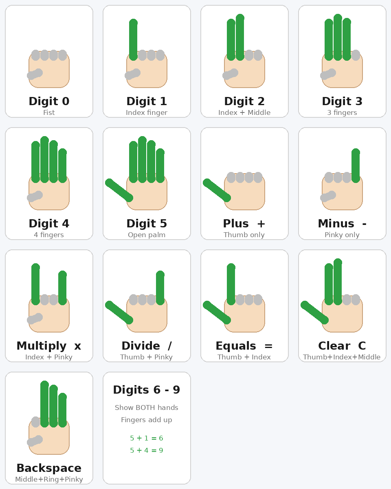
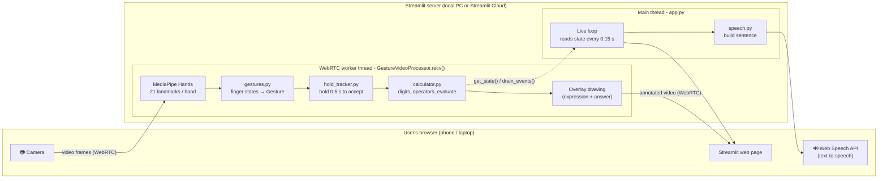
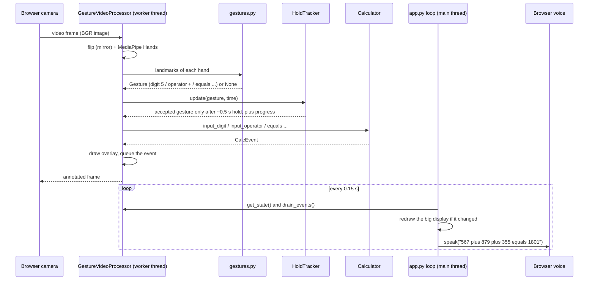
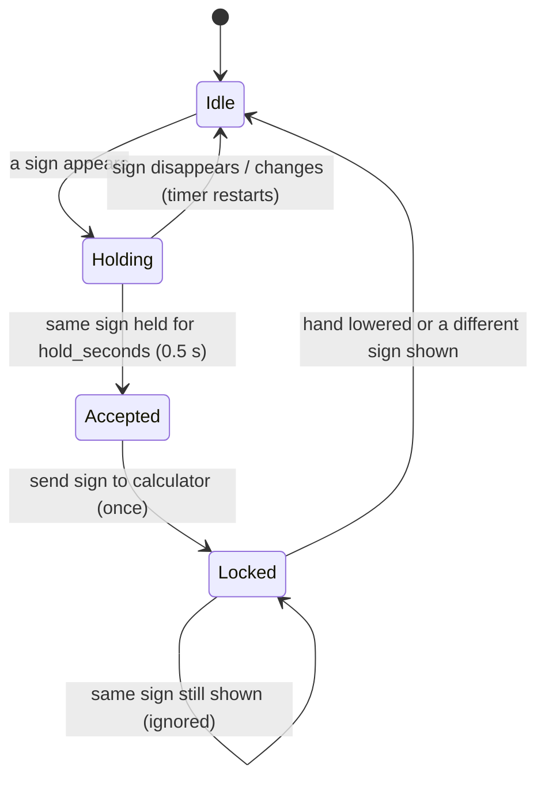
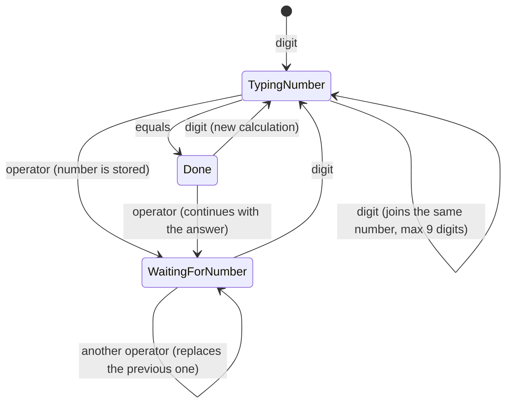

# Finger Gesture Calculator

A small **Python + Streamlit** app that opens your camera and lets you do maths **with hand signs**.
Show digits with your fingers, show an operator sign (`+ − × ÷`), and finally show the **Equals** sign to get the answer.
The whole calculation is displayed on the screen and also **spoken aloud**, so a child can see *and* hear the input and the output.

> Built with **MediaPipe Hands** (hand tracking), **streamlit-webrtc** (browser camera → Python) and the browser's **Web Speech API** (text-to-speech).

---

## Features

| Feature                   | Details                                                                                     |
|---------------------------|---------------------------------------------------------------------------------------------|
| Camera opens with the app | Uses the browser camera through WebRTC, so it also works after deployment                   |
| Finger-sign input         | Digits `0-9`, operators `+ − × ÷`, `=`, Clear and Backspace                                 |
| Multi-digit numbers       | Digits keep joining **one number** until an operator sign is shown (`5` then `6` = `56`)    |
| Answer only on `=`        | Nothing is calculated until the **Equals** sign is shown                                    |
| 0.5 second hold           | A sign is accepted only after being held steady for ~0.5 s (progress bar on the video)      |
| Start-up guide popup      | A picture chart of every sign; close it with ✕ or press *Got it - start the camera*         |
| Live screen               | Current expression and the answer are shown big next to the video **and** drawn on the video|
| Text-to-speech            | "567 plus 879 plus 355 equals 1801" - English or Hindi voice, chosen in the sidebar         |
| Streamlit-ready           | `requirements.txt` + `packages.txt` included for Streamlit Community Cloud                  |

---

## 🎬 Example: `567 + 879 + 355 =`

| Step  | You show               | Accepted after | Screen shows |
|-------|------------------------|----------------|--------------|
| 1     | Open palm (5)          | 0.5 s          | `5`          |
| 2     | Both hands: 5 + 1 (6)  | 0.5 s          | `56` ← no operator between, so it is the *same* number |
| 3     | Both hands: 5 + 2 (7)  | 0.5 s          | `567` |
| 4     | Thumbs-up (`+`)        | 0.5 s          | `567 +` |
| 5-7   | 8, 7, 9 | 0.5 s each   | `567 + 879`    |
| 8     | Thumbs-up (`+`)        | 0.5 s | `567 + 879 +` |
| 9-11  | 3, 5, 5 (lower your hand between the two 5s) | 0.5 s each | `567 + 879 + 355` |
| 12    | **Equals sign** (thumb + index) | 0.5 s | `567 + 879 + 355 = 1801` 🔊 |

---

## ✋ The hand signs



Finger order: **thumb, index, middle, ring, pinky**.

| Sign | Meaning | Fingers up |
|---|---|---|
| Fist | `0` | none |
| Index | `1` | index |
| Index + middle | `2` | index, middle |
| Three fingers | `3` | index, middle, ring |
| Four fingers | `4` | index, middle, ring, pinky (thumb folded) |
| Open palm | `5` | all five |
| **Both hands** | `6 - 9` | fingers of both hands are **added** (5 + 1 = 6 ... 5 + 4 = 9) |
| Thumbs-up | `+` | thumb |
| Pinky only | `−` | pinky |
| Rock sign | `×` | index + pinky |
| "Call me" sign | `÷` | thumb + pinky |
| "L" shape | `=` (get the answer) | thumb + index |
| Thumb + index + middle | **C** (clear all) | thumb, index, middle |
| "OK" sign | ⌫ (delete last digit / operator) | middle, ring, pinky |

Tips
* Hold the sign **steady for ~0.5 s**. Watch the green bar on the video.
* Typing the **same digit twice** (`55`, `100`)? Lower your hand (or change the sign) for a moment, then show it again.
* Operators (`+ − × ÷ =`) need **one hand only**. Two hands are used only for digits.
* Good light and a plain background make tracking much better.
* Multiplication and division follow the normal school order (BODMAS): `2 + 3 × 4 = 14`.
* After `=`, showing an operator continues with the answer (`1801 + ...`); showing a digit starts a new calculation.

---

## 🏗️ Architecture

### 1. Big picture



### 2. What happens to ONE camera frame



### 3. Modules

| File | Responsibility | Knows about the camera / Streamlit? |
|---|---|---|
| `app.py` | Page layout, sidebar settings, guide popup, live loop, start/stop | Streamlit ✔ |
| `gesture_calc/processor.py` | Per-frame pipeline, overlay drawing, thread-safe state for the UI | WebRTC + OpenCV + MediaPipe ✔ |
| `gesture_calc/gestures.py` | Landmarks → finger states → `Gesture` (digit / operator / control) | ✘ pure Python |
| `gesture_calc/hold_tracker.py` | Smoothing, 0.5 s hold, "lock" so a sign is not repeated | ✘ pure Python |
| `gesture_calc/calculator.py` | Number building, operators, BODMAS evaluation, history | ✘ pure Python |
| `gesture_calc/speech.py` | Builds the sentence to speak and plays it in the browser | Streamlit (tiny) |
| `gesture_calc/guide.py` | Draws the gesture chart picture from the same tables as `gestures.py` | ✘ (Pillow only) |
| `tests/test_logic.py` | 15 unit tests for the camera-free logic | ✘ |

The three "pure Python" modules contain all the important rules, so they can be tested with `pytest` **without a camera**.

### 4. How a hand becomes a gesture (`gestures.py`)

1. MediaPipe returns 21 landmark points per hand.
2. **Fingers** (index → pinky): a finger is *up* when its tip is clearly farther from the wrist than its middle joint. Only distances are used, so the hand may be tilted or sideways.
3. **Thumb**: up when its tip is far from the index knuckle *and* points away from the palm.
4. The five booleans `(thumb, index, middle, ring, pinky)` are looked up in two tables:
   * `DIGIT_PATTERNS` - the six digit shapes `0-5`
   * `SPECIAL_PATTERNS` - operators and controls
   The two tables share **no pattern**, so an operator can never be mistaken for a digit.
5. With **two hands**, both must be digit shapes and their values are added (`6-9`).

### 5. Hold-to-accept (`hold_tracker.py`)



* A **majority vote over the last 5 frames** hides one-frame flicker.
* **Locked** is what prevents one long hold from typing `5555555`.

### 6. Number entry (`calculator.py`)



Internally the expression is a list like `["567", "+", "879", "+", "355"]` plus the number currently being typed.
`evaluate()` uses Python's `Fraction` (exact arithmetic, no `0.1 + 0.2` surprises) and does `× ÷` first, then `+ −`.
**`eval()` is never used.**

### 7. Threads and thread-safety

`streamlit-webrtc` calls `recv()` on its own **worker thread**, while the Streamlit script runs on the **main thread**.

* The worker thread writes the calculator state; the main thread only reads it through `get_state()`.
* A `threading.Lock` guards the calculator, and a `queue.Queue` carries "what just happened" events to the main thread (used for speech).
* The main thread loop redraws the display **only when the state changed**.

### 8. Design decisions

| Decision | Reason |
|---|---|
| `streamlit-webrtc` instead of `cv2.VideoCapture(0)` | On a deployed server there is no camera. WebRTC streams the *user's* camera to the server. |
| Browser Web Speech API instead of `pyttsx3` / `gTTS` | Sound must play on the *user's* device. No extra package, no internet call. |
| Distance-based finger detection | Works for tilted hands; "tip above joint" only works for upright hands. |
| MediaPipe `model_complexity=0`, 640×480 @ 15 fps | Fast enough for the free Streamlit Cloud CPU. |
| Gesture chart drawn with Pillow from the recogniser tables | The guide can never disagree with the real signs. |
| No `eval()`, `Fraction` maths | Safe and exact. |

---

## 🗂️ Project structure

```
gesture-calculator/
├── app.py                     # Streamlit UI (entry point)
├── requirements.txt           # Python packages
├── packages.txt               # Linux packages for Streamlit Cloud (libgl1 for OpenCV)
├── README.md
├── .streamlit/config.toml
├── docs/gesture_guide.png     # picture used in this README
├── gesture_calc/
│   ├── __init__.py
│   ├── gestures.py            # landmarks -> finger states -> gesture
│   ├── hold_tracker.py        # 0.5 s hold + no-repeat lock
│   ├── calculator.py          # number building + evaluation
│   ├── processor.py           # WebRTC frame pipeline + overlay
│   ├── speech.py              # text-to-speech (browser)
│   └── guide.py               # gesture chart image
└── tests/
    └── test_logic.py
```

---

## 🚀 Run locally

Python **3.10 - 3.12** is recommended (MediaPipe 0.10.21 has wheels for these).

```bash
# 1. create and activate a virtual environment
python -m venv .venv
source .venv/bin/activate          # Windows: .venv\Scripts\activate

# 2. install
pip install -r requirements.txt

# 3. run
streamlit run app.py
```

Open the address shown in the terminal (usually http://localhost:8501), read the guide, press **✅ Got it - start the camera** and allow the camera in the browser.

Run the tests:

```bash
pytest -q
```

Re-create the guide picture (after changing any sign):

```bash
python -m gesture_calc.guide
```

---

## ☁️ Deploy on Streamlit Community Cloud

1. Push the project to a **GitHub** repository (`app.py` in the repository root).
2. Open <https://share.streamlit.io> → **Create app** → choose the repository, branch and `app.py`.
3. Open **Advanced settings** and select **Python 3.11** (or 3.12).
4. Click **Deploy**. Streamlit installs `requirements.txt` and `packages.txt` automatically.
5. Open the app link on any device, allow the camera, and start.

Notes for deployment

* **HTTPS is required** for camera access - Streamlit Cloud provides it.
* The app uses a free public **STUN** server. On some networks (strict college / office Wi-Fi, some mobile networks) WebRTC also needs a **TURN** server. If the video never starts there, add a TURN service (for example Twilio Network Traversal or Metered) to `RTC_CONFIG` in `app.py` and keep the credentials in Streamlit **Secrets**.
* The free tier has a small CPU. If the video lags, lower the frame rate in `CAMERA` (`app.py`) or keep `model_complexity=0` (already the default).
* `mediapipe` is **pinned** in `requirements.txt` on purpose: newer releases removed the classic `mp.solutions.hands` API used here.

---

## 🔧 Settings you can change

In the app sidebar: hold time (0.3 - 1.5 s), speech on/off, what to speak, English/Hindi voice, hand-skeleton on/off, and *Test voice*.

In code:

| What | Where | Default |
|---|---|---|
| Finger "up" strictness | `EXT_RATIO` in `gestures.py` | `1.10` |
| Thumb "up" strictness | `THUMB_OPEN_RATIO` in `gestures.py` | `0.55` |
| Smoothing frames | `smooth_frames` in `hold_tracker.py` | `5` |
| Longest number | `MAX_DIGITS` in `calculator.py` | `9` |
| Camera size / fps | `CAMERA` in `app.py` | 640×480 @ 15 |
| Change a sign | `DIGIT_PATTERNS` / `SPECIAL_PATTERNS` in `gestures.py` | see table above |

---

## 🩺 Troubleshooting

| Problem | Fix |
|---|---|
| `ImportError: libGL.so.1` on Streamlit Cloud | Make sure `packages.txt` contains `libgl1` |
| `module 'mediapipe' has no attribute 'solutions'` | Install the pinned version: `pip install mediapipe==0.10.21` |
| Video stays black / "Connection taking longer" | Network blocks WebRTC → add a TURN server (see deployment notes) |
| Camera does not start automatically | Browsers always ask permission; press **START** under the video once |
| No sound | Use Chrome / Edge, turn on *Speak the calculation*, press **🔈 Test voice** once. Hindi needs a Hindi voice installed on the device. |
| A wrong sign is detected | Improve light, keep the palm facing the camera, hold a little longer, or tune `EXT_RATIO` / `THUMB_OPEN_RATIO` |
| Digit is typed twice / not typed twice | Lower your hand between two identical digits; a held sign is accepted only once |

---

## ⚠️ Known limitations

* Digits `6-9` need **two hands** (one hand can show only `0-5`).
* No decimal point or negative-number input yet (results can be decimal or negative).
* Speech uses the voices installed in the browser / OS, so the sound differs between devices (and some iPhones block auto-speech until the page is tapped).
* Very fast hand movement or poor light lowers accuracy.

## 💡 Ideas for later

* Decimal point and brackets signs
* Practice mode for children (the app asks `3 + 4 = ?` and checks the answer shown by hand)
* Calibration screen to auto-tune thumb detection per user
* Use MediaPipe *Gesture Recognizer* for more sign types
* Save calculation history

## 🙌 Credits

[MediaPipe](https://developers.google.com/mediapipe) · [Streamlit](https://streamlit.io) · [streamlit-webrtc](https://github.com/whitphx/streamlit-webrtc) · [OpenCV](https://opencv.org)
